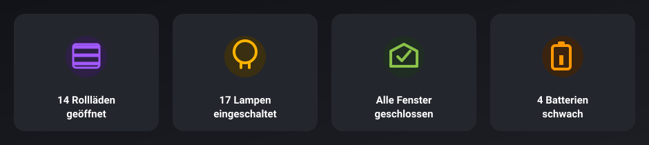
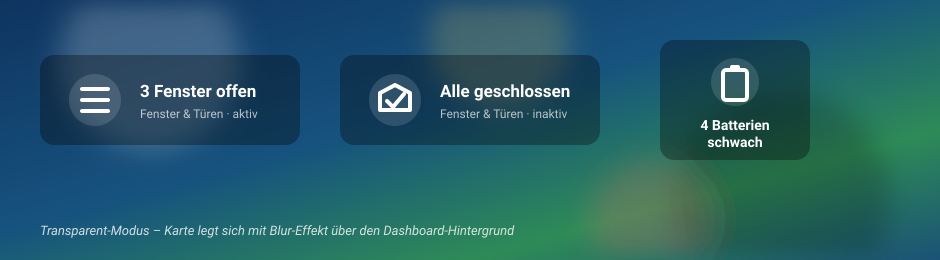
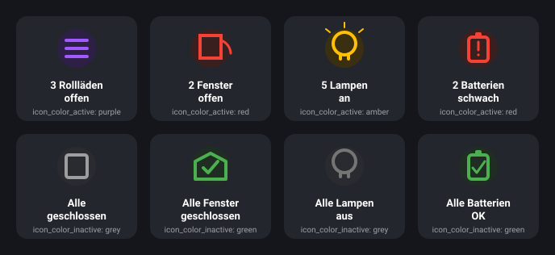
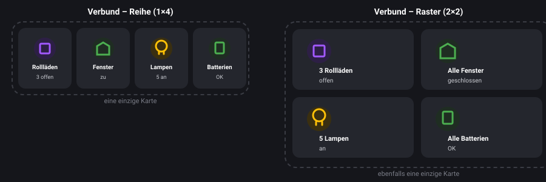
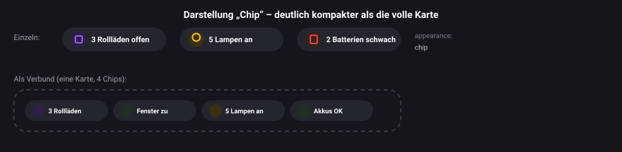
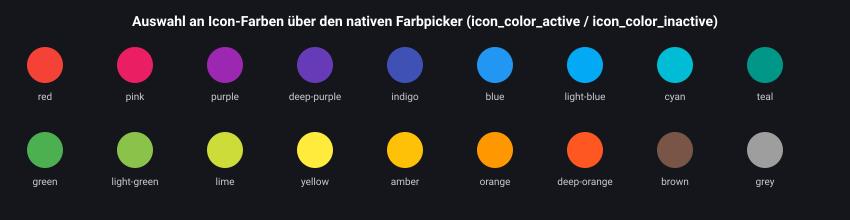

# 🏠 Status-Übersicht-Karte

Eine schlanke Lovelace-Karte für Home Assistant, die auf einen Blick zeigt, wie viele
**Rollläden**, **Fenster & Türen**, **Lampen** oder **Batterien** gerade aktiv (offen / an / schwach)
sind – komplett über das UI konfigurierbar, ganz ohne YAML.



## ✨ Features

- **4 eingebaute Modi**: Rollläden, Fenster & Türen, Lampen, Batterien
- **Verbund-Modus**: alle 4 Kategorien in einer einzigen Karte, als Reihe oder 2×2-Raster
- **Zwei Erscheinungsformen**: volle Karte oder kompakter Chip
- **Alles im visuellen Editor konfigurierbar** – kein YAML nötig
- **"Alle passenden Entitäten hinzufügen"-Button** im Editor, statt jede Entität einzeln zu suchen
- **Eigene Icons und Farben für aktiven und inaktiven Zustand**, per nativem Farbpicker
- **Zwei Layouts**: vertikal oder horizontal (bzw. Reihe/Raster im Verbund)
- **Zwei Hintergründe**: normal (Karten-Hintergrund) oder transparent mit Blur-Effekt
- **Icon-Größe und Schriftgröße** frei per Regler einstellbar
- **Größenanpassung per Drag & Drop** in der Bereiche-Ansicht
- **Frei konfigurierbare Tap-Action** (Navigieren, Mehr-Info, URL, Service-Aufruf)



## 🎨 Alle Modi – aktiv und inaktiv, jeweils mit eigener Farbe

Für jeden Modus lassen sich Icon und Farbe für den aktiven und den inaktiven Zustand
unabhängig voneinander festlegen. Ein paar Beispiele, wie bunt das werden kann:



## 🧩 Verbund-Modus – alle 4 Kategorien in einer Karte

Statt vier einzelner Lovelace-Karten nebeneinander gibt es auch den Modus **„Alle 4
Kategorien (Verbund)"** – eine einzige Karte, die alle vier Bereiche gleichzeitig zeigt,
wahlweise als Reihe oder als 2×2-Raster:



## 🔹 Chip-Darstellung – kompakte Pillen statt voller Karten

Über die Option **„Darstellung"** lässt sich statt der vollen Karte auch eine deutlich
kompaktere Chip-/Pillen-Form wählen – einzeln oder im Verbund:



## 🌈 Farbpicker

`icon_color_active` und `icon_color_inactive` werden über einen nativen Farbpicker gesetzt –
entweder aus einer Palette benannter Farben oder per eigenem Hex-Code:



> Alle Bilder oben sind Beispiel-Mockups im Design der Karte. Screenshots aus einer echten
> Dashboard-Installation folgen, sobald es welche gibt – gerne per Pull Request ergänzen!

## 📦 Installation

### Über HACS (empfohlen)

Diese Karte ist (noch) nicht im offiziellen HACS-Store gelistet, kann aber ganz einfach
als **benutzerdefiniertes Repository** hinzugefügt werden:

1. HACS öffnen → **⋮** (drei Punkte oben rechts) → **Benutzerdefinierte Repositories**
2. Repository-URL eintragen: `https://github.com/<dein-github-name>/status-summary-card`
3. Kategorie: **Dashboard**
4. Auf **Hinzufügen** klicken
5. Die Karte in der HACS-Liste suchen und installieren
6. Home Assistant neu laden (Browser-Cache bei Bedarf leeren)

### Manuell

1. [`status-summary-card.js`](status-summary-card.js) herunterladen
2. Datei nach `/config/www/status-summary-card.js` kopieren
3. Einstellungen → Dashboards → Ressourcen → Ressource hinzufügen
   - URL: `/local/status-summary-card.js`
   - Typ: **JavaScript-Modul**
4. Home Assistant neu laden

## 🧩 Verwendung

Karte in einem Dashboard hinzufügen → **Status-Übersicht-Karte** auswählen. Der visuelle
Editor führt dich durch alle Einstellungen. Unten ein paar Beispiel-Konfigurationen als
Ausgangspunkt für eigene YAML-Anpassungen.

### 🪟 Rollläden – vertikal, normal, violett

```yaml
type: custom:status-summary-card
mode: covers
entities:
  - cover.rolladen_wohnzimmer
  - cover.rolladen_kueche
  - cover.rolladen_schlafzimmer
layout: vertical
style: solid
icon_color_active: purple
icon_color_inactive: grey
```

### 🪟 Rollläden – horizontal, transparent, türkis

```yaml
type: custom:status-summary-card
mode: covers
entities:
  - cover.rolladen_buero_strasse
  - cover.rolladen_buero_garten
layout: horizontal
style: transparent
icon_color_active: teal
icon_color_inactive: "#607d8b"
icon_size: 30
font_size: 14
```

### 🚪 Fenster & Türen – vertikal, normal, rot/grün mit eigenen Icons

```yaml
type: custom:status-summary-card
mode: door_window
entities:
  - binary_sensor.fenster_kueche
  - binary_sensor.fenster_bad
  - binary_sensor.tuer_terrasse
layout: vertical
style: solid
icon_active: mdi:door-open
icon_inactive: mdi:door-closed
icon_color_active: red
icon_color_inactive: green
```

### 💡 Lampen – horizontal, transparent, amber

```yaml
type: custom:status-summary-card
mode: light
entities:
  - light.wohnzimmer_decke
  - light.kueche_arbeitsplatte
  - light.flur
layout: horizontal
style: transparent
icon_color_active: amber
icon_color_inactive: grey
tap_action:
  action: navigate
  navigation_path: /dashboard-tablet/licht
```

### 🔋 Batterien – vertikal, normal, mit Schwellwert

```yaml
type: custom:status-summary-card
mode: battery
entities:
  - sensor.hue_motion_sensor_1_battery
  - sensor.hue_motion_sensor_2_battery
  - binary_sensor.rauchmelder_kueche_battery
battery_threshold: 15
layout: vertical
style: solid
icon_color_active: deep-orange
icon_color_inactive: light-green
```

### 🔋 Batterien – horizontal, transparent

```yaml
type: custom:status-summary-card
mode: battery
entities:
  - sensor.hue_motion_sensor_1_battery
  - binary_sensor.rauchmelder_kueche_battery
battery_threshold: 20
layout: horizontal
style: transparent
icon_size: 28
font_size: 14
tap_action:
  action: navigate
  navigation_path: /dashboard-tablet/batterien
```

### 🛠️ Komplett individuell – eigener Name, eigene Icons, Service-Aufruf

```yaml
type: custom:status-summary-card
mode: covers
name: Rollläden Obergeschoss
entities:
  - cover.rolladen_kind_garten
  - cover.rolladen_kind_terrasse
  - cover.rolladen_ankleide
  - cover.rolladen_schlafzimmer
icon_active: mdi:window-shutter-alert
icon_inactive: mdi:window-shutter-cog
icon_color_active: indigo
icon_color_inactive: blue-grey
layout: vertical
style: transparent
icon_size: 40
font_size: 15
tap_action:
  action: call-service
  service: cover.close_cover
  target:
    entity_id:
      - cover.rolladen_kind_garten
      - cover.rolladen_kind_terrasse
      - cover.rolladen_ankleide
      - cover.rolladen_schlafzimmer
```

### 🧩 Verbund – alle 4 Kategorien in einer Karte, als Reihe

```yaml
type: custom:status-summary-card
mode: combo
layout: row
style: solid
covers_entities:
  - cover.rolladen_wohnzimmer
  - cover.rolladen_kueche
door_window_entities:
  - binary_sensor.fenster_kueche
  - binary_sensor.tuer_terrasse
light_entities:
  - light.wohnzimmer_decke
  - light.kueche_arbeitsplatte
battery_entities:
  - sensor.hue_motion_sensor_1_battery
  - binary_sensor.rauchmelder_kueche_battery
battery_threshold: 20
icon_color_active: purple
icon_color_inactive: grey
```

### 🧩 Verbund – als 2×2-Raster, transparent

```yaml
type: custom:status-summary-card
mode: combo
layout: grid
style: transparent
covers_entities:
  - cover.rolladen_buero_strasse
door_window_entities:
  - binary_sensor.fenster_bad
light_entities:
  - light.flur
battery_entities:
  - sensor.hue_motion_sensor_2_battery
icon_size: 30
```

### 🔹 Chip – einzelne Kategorie, kompakt

```yaml
type: custom:status-summary-card
mode: light
appearance: chip
entities:
  - light.wohnzimmer_decke
  - light.kueche_arbeitsplatte
  - light.flur
icon_color_active: amber
icon_color_inactive: grey
```

### 🔹 Chip – im Verbund, für eine schmale Statusleiste

```yaml
type: custom:status-summary-card
mode: combo
appearance: chip
layout: row
covers_entities:
  - cover.rolladen_wohnzimmer
door_window_entities:
  - binary_sensor.fenster_kueche
light_entities:
  - light.wohnzimmer_decke
battery_entities:
  - sensor.hue_motion_sensor_1_battery
```

## ⚙️ Konfigurationsoptionen

| Option                 | Typ     | Standard   | Beschreibung                                                                 |
| ----------------------- | ------- | ---------- | ----------------------------------------------------------------------------- |
| `mode`                  | string  | `covers`   | `covers`, `door_window`, `light`, `battery` oder `combo` (alle 4 zusammen)    |
| `entities`               | list    | `[]`       | Liste der zu überwachenden Entitäten (nicht bei `mode: combo`)               |
| `covers_entities`        | list    | `[]`       | Nur bei `mode: combo`: Rollläden-Entitäten                                    |
| `door_window_entities`   | list    | `[]`       | Nur bei `mode: combo`: Fenster-/Türen-Entitäten                              |
| `light_entities`         | list    | `[]`       | Nur bei `mode: combo`: Lampen-Entitäten                                       |
| `battery_entities`       | list    | `[]`       | Nur bei `mode: combo`: Batterie-Entitäten                                     |
| `expand_groups`          | boolean | `false`    | Gruppen-Entitäten (z.B. eine Lampengruppe) in ihre Mitglieder auflösen und diese statt der Gruppe selbst zählen |
| `name`                   | string  | –          | Überschreibt den automatisch generierten Text (nicht bei `mode: combo`)      |
| `icon_active`            | string  | –          | Icon bei aktivem Zustand (offen/an/schwach); sonst automatisches Standard-Icon (nicht bei `mode: combo`) |
| `icon_inactive`          | string  | –          | Icon bei inaktivem Zustand (geschlossen/aus/OK) (nicht bei `mode: combo`)     |
| `icon_color_active`      | string  | –          | Icon-Farbe bei aktivem Zustand (Farbpicker oder Hex-Code)                    |
| `icon_color_inactive`    | string  | –          | Icon-Farbe bei inaktivem Zustand                                              |
| `battery_threshold`      | number  | `20`       | Nur Modus `battery`/`combo`: Schwellwert in % für "schwach"                   |
| `layout`                 | string  | `vertical` | `vertical`/`horizontal` normal, `row`/`grid` bei `mode: combo`                |
| `appearance`             | string  | `card`     | `card` (volle Karte) oder `chip` (kompakte Pille)                            |
| `style`                  | string  | `solid`    | `solid` oder `transparent`                                                    |
| `icon_size`              | number  | `32`       | Icon-Größe in px                                                              |
| `font_size`              | number  | `13`       | Schriftgröße in px                                                            |
| `tap_action`             | action  | –          | Standard-HA-Aktion beim Antippen der Karte                                    |

## 🐛 Fehler melden / Mitwirken

Issues und Pull Requests sind willkommen! Screenshots aus echten Dashboards für die
Beispiel-Galerie werden besonders gerne genommen.

## 📄 Lizenz

[MIT](LICENSE)
