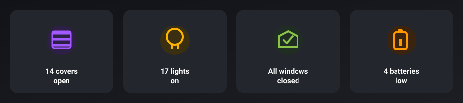
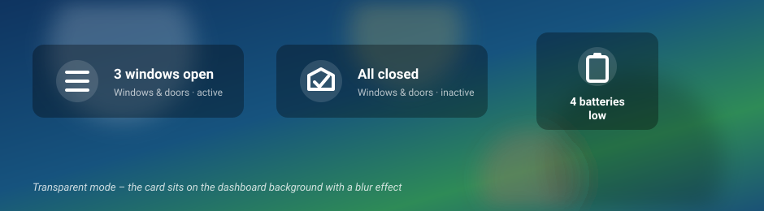
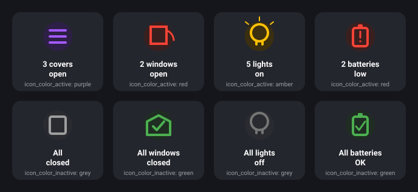
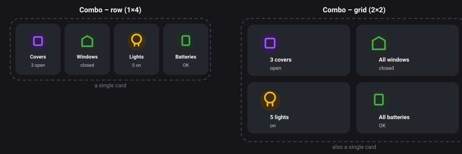
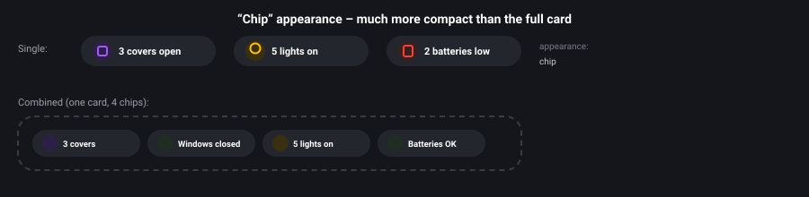
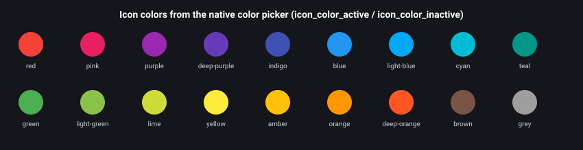

# 🏠 Status Summary Card

A lean Lovelace card for Home Assistant that shows at a glance how many
**covers**, **windows & doors**, **lights** or **batteries** are currently active (open / on / low)
– fully configurable in the UI, no YAML required.



## ✨ Features

- **4 built-in modes**: covers, windows & doors, lights, batteries
- **Combo mode**: all 4 categories in a single card, as a row or a 2×2 grid
- **Two appearances**: full card or compact chip (all the same size in combo mode, too)
- **Everything configurable in the visual editor** – no YAML required
- **"Add all matching entities" button** in the editor (in combo mode for all 4 categories at once), optionally limited to specific areas/floors
- **Own icons and colors for the active and inactive state**, with the native color picker
- **Two layouts**: vertical or horizontal (row/grid in combo mode)
- **Same design system as Trash Card Plus, EV Charge Card and Radial Flow Card**: background (theme, theme + tint, accent color, custom color, transparent) with opacity, gradient and glass effect, border, shadow, corner radius and highlight (glow, pulse, border, scale)
- **Icon size and font size** freely adjustable with sliders
- **Resizing via drag & drop** in the sections view
- **Freely configurable tap action** (navigate, more-info, URL, service call)
- **Bilingual**: editor and card texts in German when Home Assistant runs in German, otherwise in English



## 🎨 All modes – active and inactive, each with its own color

For every mode, the icon and color for the active and the inactive state can be set
independently. A few examples of how colorful it can get:



## 🧩 Combo mode – all 4 categories in one card

Instead of four separate Lovelace cards next to each other, there is also the mode **"All 4
categories (combo)"** – a single card that shows all four categories at once,
either as a row or as a 2×2 grid:



## 🔹 Chip appearance – compact pills instead of full cards

With the **"Appearance"** option you can choose a much more compact
chip/pill form instead of the full card – on its own or in combo mode:



## 🌈 Color picker

`icon_color_active` and `icon_color_inactive` are set with a native color picker –
either from a palette of named colors or with your own hex code:



> All images above are sample mockups in the card's design. Screenshots from a real
> dashboard installation will follow as soon as there are some – feel free to add them via pull request!

## 📦 Installation

### Via HACS (recommended)

This card is not (yet) listed in the official HACS store, but can easily be added
as a **custom repository**:

1. Open HACS → **⋮** (three dots top right) → **Custom repositories**
2. Enter the repository URL: `https://github.com/Kohle93/Status-Summary-Card`
3. Category: **Dashboard**
4. Click **Add**
5. Search for the card in the HACS list and install it
6. Reload Home Assistant (clear the browser cache if necessary)

### Manual

1. Download [`status-summary-card.js`](status-summary-card.js)
2. Copy the file to `/config/www/status-summary-card.js`
3. Settings → Dashboards → Resources → Add resource
   - URL: `/local/status-summary-card.js`
   - Type: **JavaScript module**
4. Reload Home Assistant

## 🧩 Usage

Add a card to a dashboard → choose **Status Summary Card**. The visual
editor guides you through all settings. Below are a few example configurations as a
starting point for your own YAML adjustments.

### 🪟 Covers – vertical, default, purple

```yaml
type: custom:status-summary-card
mode: covers
entities:
  - cover.living_room
  - cover.kitchen
  - cover.bedroom
layout: vertical
icon_color_active: purple
icon_color_inactive: grey
```

### 🪟 Covers – horizontal, transparent, teal

```yaml
type: custom:status-summary-card
mode: covers
entities:
  - cover.office_street
  - cover.office_garden
layout: horizontal
card_bg_opacity: 30
card_blur: 6
icon_color_active: teal
icon_color_inactive: "#607d8b"
icon_size: 30
font_size: 14
```

### 🚪 Windows & doors – vertical, default, red/green with own icons

```yaml
type: custom:status-summary-card
mode: door_window
entities:
  - binary_sensor.kitchen_window
  - binary_sensor.bathroom_window
  - binary_sensor.patio_door
layout: vertical
icon_active: mdi:door-open
icon_inactive: mdi:door-closed
icon_color_active: red
icon_color_inactive: green
```

### 💡 Lights – horizontal, transparent, amber

```yaml
type: custom:status-summary-card
mode: light
entities:
  - light.living_room_ceiling
  - light.kitchen_counter
  - light.hallway
layout: horizontal
card_bg_opacity: 30
card_blur: 6
icon_color_active: amber
icon_color_inactive: grey
tap_action:
  action: navigate
  navigation_path: /dashboard-tablet/lights
```

### 🔋 Batteries – vertical, default, with threshold

```yaml
type: custom:status-summary-card
mode: battery
entities:
  - sensor.hue_motion_sensor_1_battery
  - sensor.hue_motion_sensor_2_battery
  - binary_sensor.kitchen_smoke_detector_battery
battery_threshold: 15
layout: vertical
icon_color_active: deep-orange
icon_color_inactive: light-green
```

### 🔋 Batteries – horizontal, transparent

```yaml
type: custom:status-summary-card
mode: battery
entities:
  - sensor.hue_motion_sensor_1_battery
  - binary_sensor.kitchen_smoke_detector_battery
battery_threshold: 20
layout: horizontal
card_bg_opacity: 30
card_blur: 6
icon_size: 28
font_size: 14
tap_action:
  action: navigate
  navigation_path: /dashboard-tablet/batteries
```

### 🛠️ Fully customized – own name, own icons, service call

```yaml
type: custom:status-summary-card
mode: covers
name: Upstairs covers
entities:
  - cover.kids_room_garden
  - cover.kids_room_patio
  - cover.dressing_room
  - cover.bedroom
icon_active: mdi:window-shutter-alert
icon_inactive: mdi:window-shutter-cog
icon_color_active: indigo
icon_color_inactive: blue-grey
layout: vertical
card_bg_opacity: 30
card_blur: 6
icon_size: 40
font_size: 15
tap_action:
  action: call-service
  service: cover.close_cover
  target:
    entity_id:
      - cover.kids_room_garden
      - cover.kids_room_patio
      - cover.dressing_room
      - cover.bedroom
```

### 🧩 Combo – all 4 categories in one card, as a row

```yaml
type: custom:status-summary-card
mode: combo
layout: row
covers_entities:
  - cover.living_room
  - cover.kitchen
door_window_entities:
  - binary_sensor.kitchen_window
  - binary_sensor.patio_door
light_entities:
  - light.living_room_ceiling
  - light.kitchen_counter
battery_entities:
  - sensor.hue_motion_sensor_1_battery
  - binary_sensor.kitchen_smoke_detector_battery
battery_threshold: 20
icon_color_active: purple
icon_color_inactive: grey
```

### 🧩 Combo – as a 2×2 grid, transparent

```yaml
type: custom:status-summary-card
mode: combo
layout: grid
card_bg_mode: none
card_border_mode: none
bg_opacity: 30
blur: 6
covers_entities:
  - cover.office_street
door_window_entities:
  - binary_sensor.bathroom_window
light_entities:
  - light.hallway
battery_entities:
  - sensor.hue_motion_sensor_2_battery
icon_size: 30
```

### 🔹 Chip – single category, compact

```yaml
type: custom:status-summary-card
mode: light
appearance: chip
entities:
  - light.living_room_ceiling
  - light.kitchen_counter
  - light.hallway
icon_color_active: amber
icon_color_inactive: grey
```

### 🔹 Chip – in combo mode, for a narrow status bar

```yaml
type: custom:status-summary-card
mode: combo
appearance: chip
layout: row
covers_entities:
  - cover.living_room
door_window_entities:
  - binary_sensor.kitchen_window
light_entities:
  - light.living_room_ceiling
battery_entities:
  - sensor.hue_motion_sensor_1_battery
```

### 🎨 Custom background color with opacity slider

```yaml
type: custom:status-summary-card
mode: light
entities:
  - light.living_room_ceiling
  - light.kitchen_counter
card_bg_mode: custom
card_bg_color: [26, 35, 126]
card_bg_opacity: 55
card_blur: 6
icon_color_active: amber
icon_color_inactive: "#ffffff"
```

### ✨ Glow like the Radial Flow Card

```yaml
type: custom:status-summary-card
mode: door_window
entities:
  - binary_sensor.kitchen_window
accent_color: [76, 175, 80]
card_bg_mode: tinted
card_bg_opacity: 30
card_bg_gradient: true
highlight: glow
```

## ⚙️ Configuration options

| Option                 | Type    | Default    | Description                                                                   |
| ----------------------- | ------- | ---------- | ----------------------------------------------------------------------------- |
| `mode`                  | string  | `covers`   | `covers`, `door_window`, `light`, `battery` or `combo` (all 4 together)       |
| `entities`               | list    | `[]`       | List of entities to monitor (not with `mode: combo`)                          |
| `covers_entities`        | list    | `[]`       | Only with `mode: combo`: cover entities                                       |
| `door_window_entities`   | list    | `[]`       | Only with `mode: combo`: window/door entities                                 |
| `light_entities`         | list    | `[]`       | Only with `mode: combo`: light entities                                       |
| `battery_entities`       | list    | `[]`       | Only with `mode: combo`: battery entities                                     |
| `filter_areas`           | list    | `[]`       | Only for the "Add all" button: limit the search to these areas                |
| `filter_floors`          | list    | `[]`       | Only for the "Add all" button: limit the search to these floors               |
| `expand_groups`          | boolean | `false`    | Expand group entities (e.g. a light group) into their members and count those instead of the group itself |
| `name`                   | string  | –          | Overrides the automatically generated text (not with `mode: combo`)           |
| `icon_active`            | string  | –          | Icon for the active state (open/on/low); otherwise the automatic default icon (not with `mode: combo`) |
| `icon_inactive`          | string  | –          | Icon for the inactive state (closed/off/OK) (not with `mode: combo`)          |
| `icon_color_active`      | string  | –          | Icon color for the active state (color picker or hex code)                   |
| `icon_color_inactive`    | string  | –          | Icon color for the inactive state                                             |
| `battery_threshold`      | number  | `20`       | Only `battery`/`combo` mode: threshold in % for "low"                         |
| `layout`                 | string  | `vertical` | `vertical`/`horizontal` normally, `row`/`grid` with `mode: combo`             |
| `appearance`             | string  | `card`     | `card` (full card) or `chip` (compact pill)                                   |
| `tap_action`             | action  | –          | Standard HA action when tapping the card                                      |

### 🎨 Design (same as Trash Card Plus, EV Charge Card and Radial Flow Card)

All design options are in the **Design** tab of the editor – with the same options,
names and YAML keys as in the other cards. Design YAML can therefore be copied
between the cards. With a single category, the card itself is the surface (as a chip,
the pill); in combo mode, four tiles sit on the card and have additional tile options.

**Card**

| Option | Default | Values |
| --- | --- | --- |
| `accent_color` | theme accent | Color for `tinted`, `accent` and the accent border of the card |
| `card_bg_mode` | `theme` | `theme`, `tinted` (theme + tint), `accent`, `custom`, `none` |
| `card_bg_color`, `card_bg_opacity`, `card_bg_gradient` | – / `100` / `false` | Custom color, opacity in % (for `tinted` the strength of the tint), gradient |
| `card_blur` | `0` | Blur behind the card in px (glass effect) |
| `card_border_mode` | `theme` | `theme`, `none`, `accent`, `custom` (+ `card_border_color`, `card_border_width`) |
| `card_shadow` | `theme` | `theme`, `none`, `soft`, `strong` |
| `card_radius` | theme | Corner radius in px |
| `card_padding` | `4` | Combo mode only: padding of the card around the tiles |

**Icon & text**

| Option | Default | Values |
| --- | --- | --- |
| `icon_color_active`, `icon_color_inactive` | primary / grey | State colors (color picker, hex or HA color name) |
| `icon_size` | `32` | Icon size in px |
| `icon_color_mode` | `auto` | `auto`, `accent` (state color), `text`, `custom` (+ `icon_color`) |
| `icon_bg_mode`, `icon_bg_color`, `icon_bg_opacity`, `icon_shape` | `none` / – / `20` / `circle` | `none`, `accent`, `theme`, `custom`; shape `circle`, `rounded`, `square` |
| `text_color_mode`, `text_color` | `auto` | `auto`, `theme`, `custom` |
| `font_size` | `13` | Font size in px |
| `padding`, `gap` | `16` / `8` | Padding and gap between icon and text |
| `highlight` | `none` | `none`, `glow`, `pulse`, `border`, `scale` – as long as the active state applies |

**Tiles (combo mode only)**

| Option | Default | Values |
| --- | --- | --- |
| `bg_mode` | `theme` | `theme`, `tinted`, `accent` (state color), `custom`, `none` |
| `bg_color`, `bg_opacity`, `bg_gradient`, `blur` | – / `100` / `false` / `0` | Same as for the card, per tile |
| `border_mode`, `border_color`, `border_width` | `none` / – / `1` | `none`, `accent`, `theme`, `custom` |
| `shadow` | `soft` | `theme`, `none`, `soft`, `strong` |
| `radius` | `14` | Corner radius of the tiles in px |

Older keys (`style`, `background_color`, `background_opacity` and, up to v2.3, the
tile values in single mode) are migrated to the new keys automatically.

## 🐛 Reporting bugs / contributing

Issues and pull requests are welcome! Screenshots from real dashboards for the
example gallery are especially appreciated.

## 📄 License

[MIT](LICENSE)
